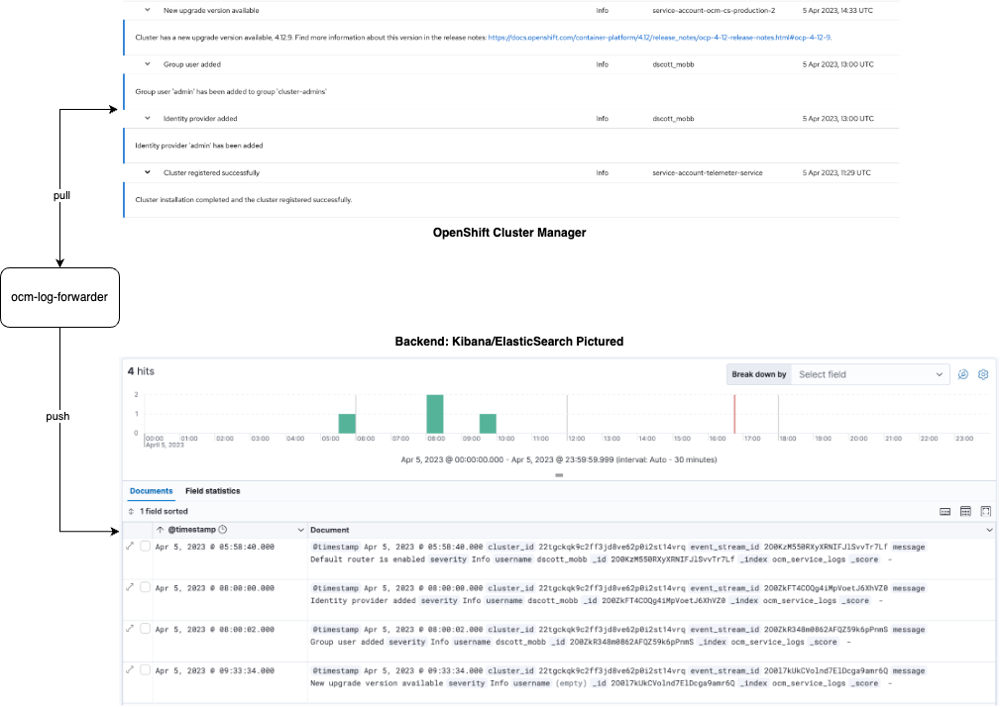

# ocm-log-forwarder

This project is not supported by Red Hat.  It was a thought experiment on how to take Service Logs from 
[OpenShift Cluster Manager](https://docs.openshift.com/rosa/ocm/ocm-overview.html) and send them to a 
backend system for audit purposes.  It is specifically tested with ROSA OpenShift clusters that are 
registered with OCM.

The below diagram shows a visualization of what this project is intended to do:



## Walkthrough

### Set Environment

This sets the environment for all followon commands:

```bash
export NAMESPACE=ocm-log-forwarder
export CLUSTER_NAME="my-cluster-name"
export OCM_CLUSTER_ID=$(rosa describe cluster -c ${CLUSTER_NAME} | grep '^ID:' | awk '{print $NF}')
export OCM_TOKEN_PATH="/path/to/my/ocm/token.json"
```

### Deploying the Backend (Optional)

**NOTE:** This step is only required if you want to test this and do not have a backend to integrate into.

1. Create a ROSA cluster using your preferred method.

2. Enable the ElasticSearch operator:

**NOTE:** for now the ElasticSearch operator is all that is supported by the code base, however it should be 
flexible enough to add more backends moving forward, as needed.

```bash
make es-operator
```

3. Create the Namespace:

```bash
make es-namespace
```

4. Deploy the ElasticSearch components:

```bash
make es-components
```

### Deploying the Operator

In order to leverage the `ocm-log-forwarder`, you need to deploy the [ocm-log-forwarder-operator](https://github.com/scottd018/ocm-log-forwarder-operator).  Be 
sure to substitute the appropriate version for the operator in the below command (see https://github.com/scottd018/ocm-log-forwarder-operator/releases for
available versions).

```
VERSION=v0.1.1
oc apply -f https://github.com/scottd018/ocm-log-forwarder-operator/releases/download/${VERSION}/deploy.yaml
```

### Deploy the Secrets

Before deploying the secrets, create the namespace where the log forwarders will run:

```bash
oc create ns $NAMESPACE
```

1. Create your OCM token as a secret in OpenShift.  This allows the log forwarder to 
integrate with OCM to pull service logs:

```bash
oc -n $NAMESPACE create secret generic ocm-token --from-file=$OCM_CLUSTER_ID=$OCM_TOKEN_PATH
```

#### Deploy the Backend Secret

1. Deploy the backend secret.  For basic authentication with ElasticSearch, we need a 
secret that contains a single key/value pair containing our username/password for authentication.

**WARN:** for production workflows, be sure to take care of the way you deploy the secret.  This 
is only for reference to show mechanics of what is needed.

**NOTE:** if you [deployed the sample backend](#deploying-the-backend-optional), then you can locate your
secret at `elastic-system/elasticsearch-es-elastic-user`.

```bash
oc -n $NAMESPACE create secret generic elastic-auth --from-literal=elastic=password
```

### Deploy the Workload

Finally, you can deploy the workload.  Be sure to substitute any values that you need to:

```bash
oc create -f - <<EOF
apiVersion: apps.dustinscott.io/v1alpha1
kind: OCMLogForwarder
metadata:
  name: ocm-log-forwarder
  namespace: $NAMESPACE
spec:
  ocm:
    secretRef: "ocm-token"
    clusterId: "$OCM_CLUSTER_ID"
    pollInternalMinutes: 5
  backend:
    elasticSearch:
      secretRef: "elastic-auth"
      url: "https://elasticsearch-es-http.elastic-system.svc.cluster.local:9200"
      authType: "basic"
      index: "ocm_service_logs"
    type: "elasticsearch"
  version: "latest"
  debug: false
EOF
```

### Testing (Without Deploying the Controller)

1. During development, I found it beneficial to be be able to test outside of deploying to an 
actual cluster.  To do so, you simply need to set some environment variables and run a 
command:

**NOTE:** the above follows the naming of components created during the walkthrough.  If you
have adjusted part of the walkthrough for your use case, be sure to adjust your workflow 
appropriately

```bash
export OCM_CLUSTER_ID=$(rosa describe cluster -c ${CLUSTER_NAME} | grep '^ID:' | awk '{print $NF}')
export BACKEND_ES_SECRET_NAME="elasticsearch-es-elastic-user"
export BACKEND_ES_SECRET_NAMESPACE="elastic-system"
export BACKEND_ES_URL="https://$(oc -n ${BACKEND_ES_SECRET_NAMESPACE} get route elasticsearch --no-headers | awk '{print $2}')"

# lower the poll interval from default to see things happen quicker
export OCM_POLL_INTERVAL_MINUTES=1
```

2. Run the test:

```bash
go run main.go

...
#1 2023-04-05 10:44:53 processor.go:55 ▶ INF initializing kubernetes cluster config: cluster=[cluster-id]
#2 2023-04-05 10:44:53 processor.go:67 ▶ WAR unable to initialize cluster config: cluster=[cluster-id], attempting file initialization
#3 2023-04-05 10:44:53 processor.go:71 ▶ INF initializing kubernetes file config: cluster=[cluster-id], file=[/Users/dscott/.kube/config]
#4 2023-04-05 10:44:53 controller.go:28 ▶ INF initializing backend: cluster=[cluster-id], type=[elasticsearch]
#5 2023-04-05 10:44:54 controller.go:35 ▶ INF initializing poller: cluster=[cluster-id], interval=[1 minutes]
#6 2023-04-05 10:44:54 controller.go:57 ▶ INF starting main program loop
#7 2023-04-05 10:44:54 controller.go:87 ▶ INF polling openshift cluster manager: cluster=[cluster-id]
#8 2023-04-05 10:44:54 poller.go:27 ▶ INF refreshing token: cluster=[cluster-id]
#9 2023-04-05 10:44:54 token.go:31 ▶ INF retrieving cluster secret: cluster=[cluster-id], secret=[ocm-token]
#10 2023-04-05 10:44:54 token.go:37 ▶ INF retrieving bearer token: cluster=[cluster-id]
#11 2023-04-05 10:44:54 poller.go:34 ▶ INF retrieving service logs: cluster=[cluster-id]
#12 2023-04-05 10:44:54 elasticsearch.go:119 ▶ INF sending items to elasticsearch: cluster=cluster-id, event_stream_id=event-stream-id, index=ocm_service_logs
#13 2023-04-05 10:44:54 elasticsearch.go:119 ▶ INF sending items to elasticsearch: cluster=cluster-id, event_stream_id=event-stream-id, index=ocm_service_logs
#14 2023-04-05 10:44:54 elasticsearch.go:119 ▶ INF sending items to elasticsearch: cluster=cluster-id, event_stream_id=event-stream-id, index=ocm_service_logs
#15 2023-04-05 10:44:54 elasticsearch.go:119 ▶ INF sending items to elasticsearch: cluster=cluster-id, event_stream_id=event-stream-id, index=ocm_service_logs
...
```

3. Open Kibana and view the logs (index name is `ocm_service_logs` or can be specified by `BACKEND_ES_INDEX`).  You can get the URL by running the following:

```bash
KIBANA_URL="https://$(oc -n ${BACKEND_ES_SECRET_NAMESPACE} get route kibana --no-headers | awk '{print $2}')"
echo $KIBANA_URL
```
